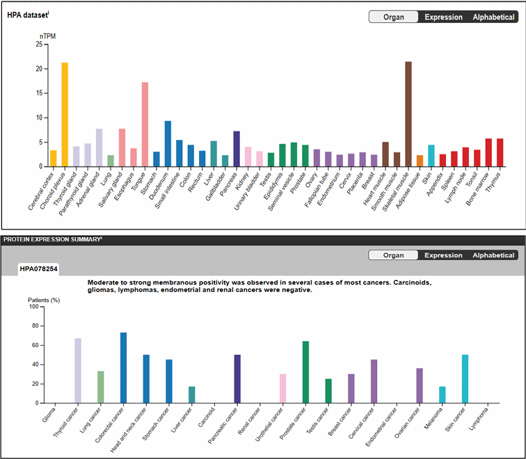
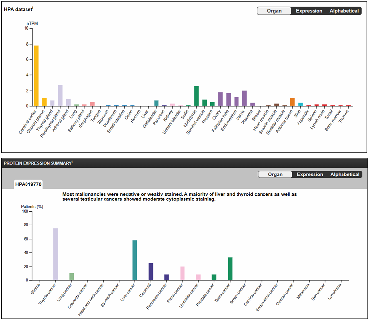
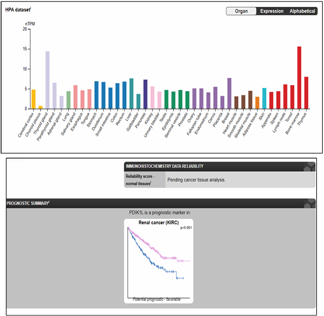
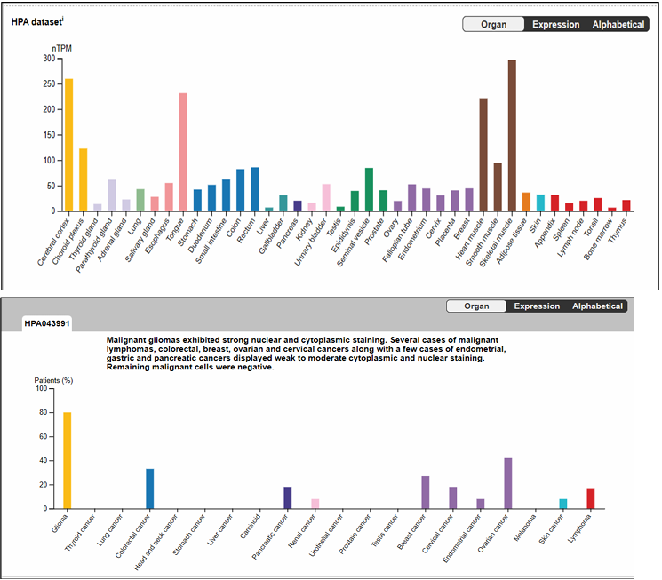
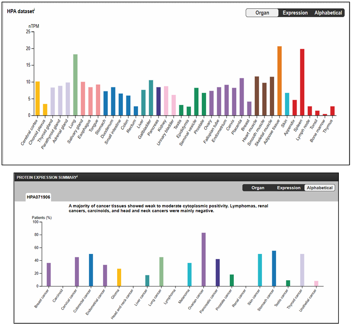
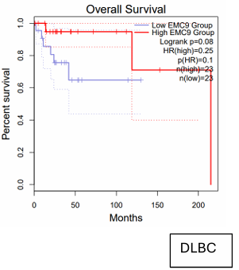
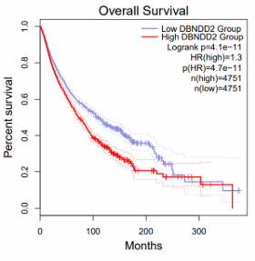

<body>

<h1>Exploring Understudied Human Protein-Coding Genes in Cancer</h1>

<h2>Abstract</h2>

In this project, I explored a group of understudied human protein-coding genes to evaluate their potential relevance in cancer. In addition to four provided genes, I selected five underrepresented genes: <strong>EMC9, FAM171A2, PDIK1L, DBNDD2, CASKIN2</strong>, based on limited functional annotation in UniProt, Pfam/InterPro, and the literature. For each gene, basic information on predicted domains, Gene Ontology (GO) terms, and expression patterns was compiled.

Using <strong>GEPIA2</strong>, tumor and normal expression across TCGA and GTEx datasets was compared. Notable trends include EMC9 overexpression in thymoma and DLBCL, and PDIK1L survival associations in kidney cancer. RNA-protein comparisons using the Human Protein Atlas (HPA) revealed some RNA-protein mismatches, which are expected for low-expression, poorly characterized genes. Single-cell RNA-seq datasets (GSE72056 and GSE115978) showed consistent cell-type expression patterns. A scalable Seurat workflow was developed to integrate multiple scRNA-seq datasets for cluster-level summaries. Overall, this study highlights how minimal public data can provide preliminary clues about uncharacterized genes, some of which may warrant further investigation in cancer biology.

<h2>Cancer Target Discovery</h2>

<h3>Identifying and Characterizing Understudied Human Protein-Coding Genes</h3>

<h4>Rationale</h4>

Genes were selected based on three criteria: (i) truly understudied, (ii) minimal known function, and (iii) detectable expression in human tissues or cancers suitable for analysis using TCGA and GTEx data.

<h4>Seed Genes</h4>

The exercise provided four initial genes: <strong>C1orf174, LOC124903857, TMEM161B, ZNF808</strong>. These served as anchors for defining criteria for poorly characterized protein-coding genes.

<h4>Finding Tdark Genes</h4>

Using the <strong>Pharos (NIH IDG)</strong> platform, genes were classified into Target Development Levels (TDLs):

<ul>
    <li><strong>Tclin:</strong> established drug targets</li>
    <li><strong>Tchem:</strong> targets with small molecule interactions</li>
    <li><strong>Tbio:</strong> targets with substantial biological information</li>
    <li><strong>Tdark:</strong> targets with very little functional information, few publications, limited GO terms, and scarce protein domain data</li>
</ul>

Selection filters for Tdark genes included:

<ul>
    <li>2–10 PubMed publications</li>
    <li>Minimal Gene Ontology annotations</li>
    <li>Unreviewed UniProt (TrEMBL) entries with low annotation scores (≤2/5)</li>
    <li>Few or no recognized protein domains in InterPro/Pfam</li>
    <li>Limited proof of protein expression</li>
</ul>

<h4>Final Gene Panel</h4>

Five Tdark genes were selected: <strong>EMC9, FAM171A2, PDIK1L, DBNDD2, CASKIN2</strong>.

<table>
<tr>
<th>Gene</th><th>Gene ID</th><th>Description</th><th>Protein Family</th><th>Expression / Domains</th>
</tr>
<tr>
<td>C1orf174</td><td>339448</td><td>Chromosome 1 open reading frame 174</td><td>-</td><td>Prognostic marker in liver, lung, pancreatic cancers</td>
</tr>
<tr>
<td>LOC124903857</td><td>124903857</td><td>FAM231A/C-like protein</td><td>FAM231 family / Homeobox</td><td>-</td>
</tr>
<tr>
<td>TMEM161B</td><td>153396</td><td>Transmembrane protein 161B</td><td>Transmembrane protein family</td><td>Prognostic marker in kidney and rectal cancers</td>
</tr>
<tr>
<td>ZNF808</td><td>388558</td><td>Zinc Finger Protein 808</td><td>C2H2 zinc finger</td><td>Prognostic marker in kidney cancer</td>
</tr>
<tr>
<td>EMC9</td><td>51016</td><td>ER membrane protein complex subunit 9</td><td>ER membrane complex</td><td>Upregulated RNA in THYM & DLBC; weak/negative protein; EMC9 domain</td>
</tr>
<tr>
<td>FAM171A2</td><td>284069</td><td>Family with sequence similarity 171 member A2</td><td>FAM171 family</td><td>Prognostic marker in glioblastoma, kidney papillary carcinoma; Signal domain</td>
</tr>
<tr>
<td>PDIK1L</td><td>149420</td><td>PDLIM1-interacting kinase 1-like</td><td>PDLIM1-interacting kinase-like</td><td>Moderate expression; prognostic in kidney cancer; Phosphorylase kinase domain</td>
</tr>
<tr>
<td>DBNDD2</td><td>55861</td><td>Dysbindin domain containing 2</td><td>Dysbindin domain proteins</td><td>High RNA in brain, muscle, and adipose; Dysbindin domain</td>
</tr>
<tr>
<td>CASKIN2</td><td>57513</td><td>CASK interacting protein 2</td><td>CASK-interacting scaffold proteins</td><td>Low/moderate RNA; strong protein in ovarian/stomach cancers; Ankyrin repeats, SH3, SAM</td>
</tr>
</table>

<h3>Expression in Cancer</h3>

Across all nine genes, functional annotation was sparse. HPA data and GEPIA2 analyses revealed potential cancer relevance:

<ul>
<li>
<strong>EMC9:</strong> Low tissue specificity; modest RNA across normal tissues; protein moderate in colorectal, thyroid, prostate, and skin cancers. Discrepancies between RNA and protein suggest transcriptional activity with limited protein detection.
  

</li>
 
<li>
<strong>FAM171A2:</strong> Highest in cerebral cortex and epididymis; mostly weak or negative staining in cancers, with moderate cytoplasmic positivity in liver and thyroid.
  

</li>
 
<li>
<strong>PDIK1L:</strong> Low/moderate RNA across tissues; prognostic in kidney cancer (KIRC) with favorable survival association.
  

</li>
 
<li>
<strong>DBNDD2:</strong> Broadly expressed; high in gliomas; high expression correlates with poor prognosis across multiple cancers.
  

</li>
 
<li>
<strong>CASKIN2:</strong> Low/moderate RNA; strong protein in ovarian and stomach cancers; tumor-selective expression suggests potential tissue-specific roles.
  

</li>
</ul>

<ul>
  <li>EXPRESSION DIY
    <ul>
      <li>Results for EMC9</li>
      <li>Expression
        <ul>
          <li>DIY</li>
          <li>Expression Analysis
            <ul>
              <li>Tumor = Red, Normal = Yellow</li>
            </ul>
          </li>
        </ul>
      </li>
      <li>Survival Analysis
        <ul>
          <li>Pan cancer</li>
          <li>Box plot
            <ul>
              <li>Gene symbol</li>
              <li>Cancer type specific</li>
            </ul>
          </li>
        </ul>
      </li>
    </ul>
  </li>

  <li>Observations
    <ul>
      <li>EMC9 shows significantly higher RNA expression in diffuse large B-cell lymphoma (DLBC) in GEPIA2, but HPA protein data is almost uniformly negative.</li>
      <li>Similar RNA-protein mismatch observed in thymoma (THYM).</li>
      <li>RNA-protein differences may result from:
        <ul>
          <li>Antibody sensitivity limitations</li>
          <li>Post-transcriptional regulation</li>
          <li>Differences between RNA-seq cohorts and tissue microarrays</li>
        </ul>
      </li>
      <li>HPA RNA expression comes from large-scale bulk RNA-seq (GTEx, TCGA), providing robust quantitative data.</li>
      <li>HPA protein expression relies on immunohistochemistry, small sample sizes, and manual staining assessment.</li>
      <li>Discrepancies between RNA and protein are expected, especially for understudied Tdark genes.</li>
    </ul>
  </li>

  <li>SURVIVAL ANALYSIS
    <ul>
      <li>Interpretation:
        <ul>
          <li>High vs low expression groups analyzed for prognosis.</li>
          <li>Hazard ratios, log-rank p-values, and curve patterns considered.</li>
        </ul>
      </li>
      <li>EMC9
        <ul>
          <li>Upregulated in THYM and DLBC in GEPIA2.</li>
          <li>DLBC:
            <ul>
              <li>High EMC9 group shows better trend (HR ~0.25), but p-values not significant (log-rank p ~0.08, p(HR) ~0.10).</li>
              <li>Small sample size limits confidence (23 high vs 28 low).</li>
                
            </ul>
          </li>
          <li>THYM:
            <ul>
              <li>High EMC9 trend toward better survival (HR ~0.42), but log-rank p ~0.23, p(HR) ~0.24; not statistically significant.</li>
              <li>EMC9 not a reliable prognostic marker in thymoma.</li>
                
            </ul>
          </li>
        </ul>
      </li>
      <li>DBNDD2
        <ul>
          <li>Pan-cancer survival: High DBNDD2 expression = worse outcomes.</li>
          <li>Red curve drops faster than blue; p-values extremely small; large sample size = reliable result.</li>
            
        </ul>
      </li>
    </ul>
  </li>
</ul>

<h3>Conclusion</h3>

Systematic integration of public data reveals preliminary insights into understudied genes. Several candidates (DBNDD2, CASKIN2) show potential relevance in cancer biology and merit further experimental investigation.

</body>
</html>
